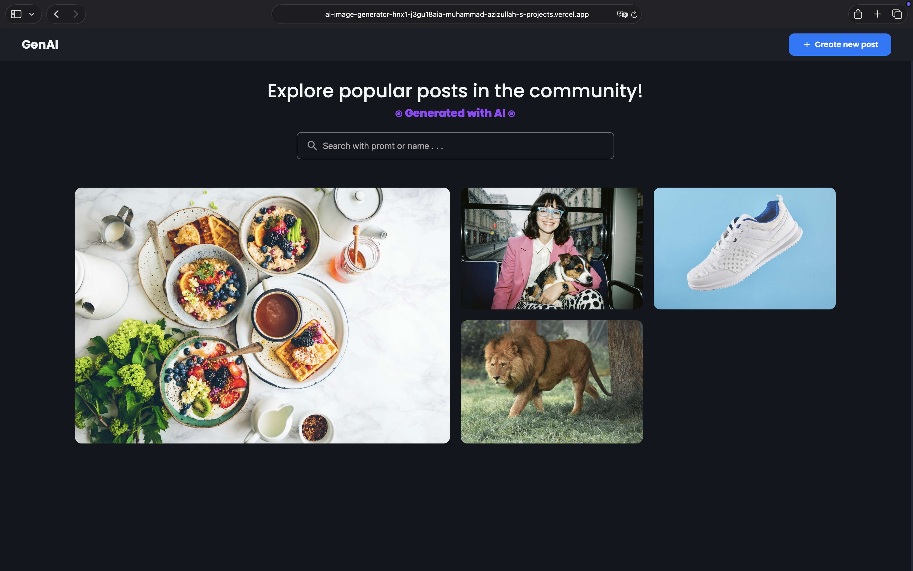
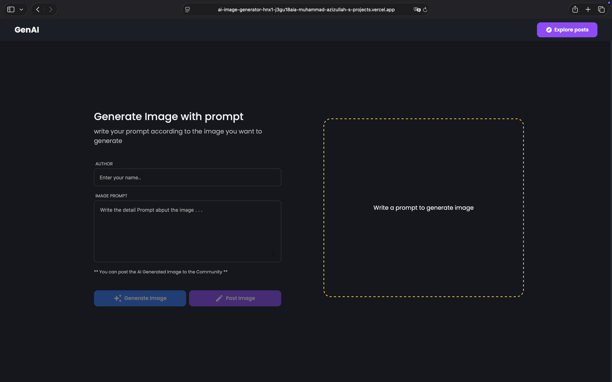

# 🎨 AI Image Generator

**AI Image Generator** An AI-powered image generation web app built using the **MERN stack** (MongoDB, Express, React, Node.js).
This project allows users to generate images from text prompts using AI models.

---

## 🖼️ Screenshots

### Home Page

### Create Image Page

### Hover Preview

---

### Frontend
- React.js

### Backend
- Node.js
- Express.js
- MongoDB

## 🚀 Features
🧠 Generate images from text prompts
🌐 Full-stack MERN application
💾 Save generated images to database
📂 Organized client-server architecture
⚡ Fast and responsive UI

---

🏗️ Project Structure
client/   # Frontend (React)
server/   # Backend (Node.js / Express)

---

## ⚙️ Setup
Clone the repo
git clone https://github.com/your-username/ai-image-generator.git
cd ai-image-generator
Install dependencies
Client
cd client
npm install
Server
cd server
npm install

---

## ▶️ Run the app
Start backend:
cd server
npm run dev
Start frontend:
cd client
npm start

---

### 🌐 Live Demo: 
https://ai-image-generator-hnx1-j3gu18aia-muhammad-azizullah-s-projects.vercel.app
